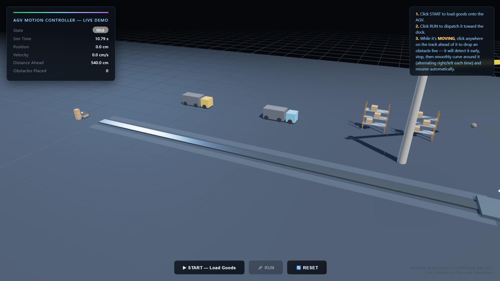
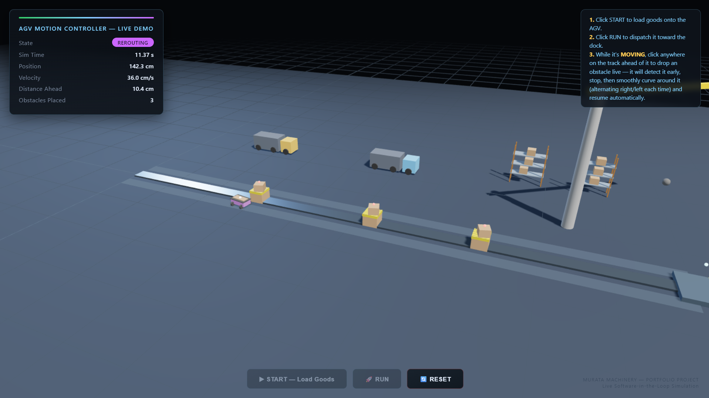
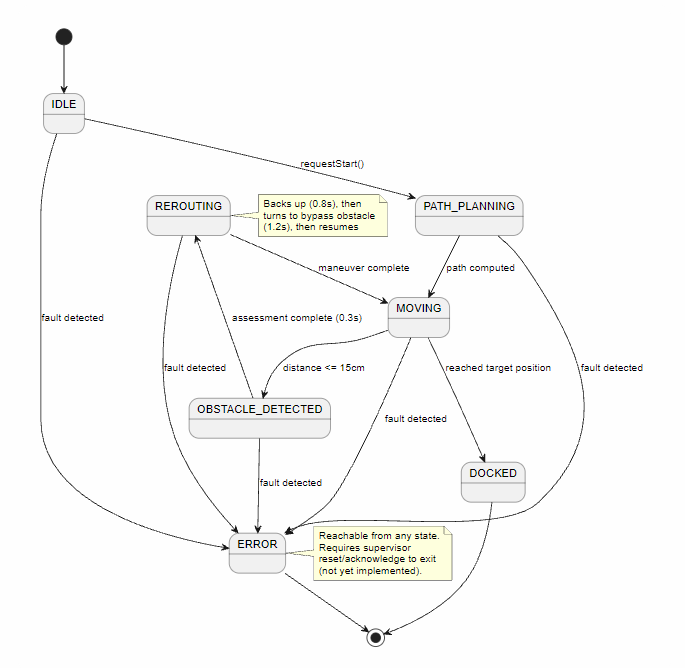
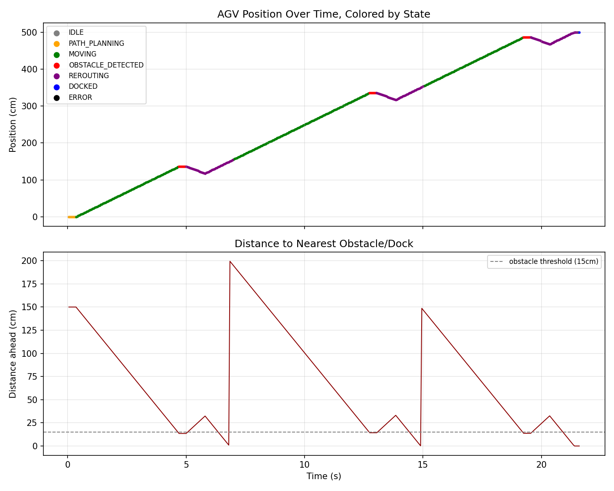

# AGV Motion Controller with State-Machine Navigation

A C++ control-system simulation of an Automated Guided Vehicle (AGV) navigating
a fixed rail, detecting obstacles, and rerouting around them — built as a
software-in-the-loop (SIL) simulation with a hardware-abstraction layer (HAL)
so the same control logic is portable to real STM32/Arduino hardware.


## Tech Stack

| Layer | Technology |
|---|---|
| Control logic (core simulation) | C++17 |
| Control logic (live browser demo) | JavaScript (1:1 port of the C++ state machine) |
| 3D rendering | Three.js (WebGL) |
| Compiler / toolchain | g++ (MinGW-w64 via MSYS2) |
| Data visualization | Python, matplotlib, pandas |
| UML modeling | PlantUML |
| Version control | Git / GitHub |
| Hosting | GitHub Pages |


## How the dashboard connects to the C++ engine

The interactive 3D dashboard is not a separate reimplementation — it is driven
directly by the same C++ control logic used in the CLI simulation
(`src/AGVController.cpp`), compiled to WebAssembly via Emscripten
(`wasm/LiveController.cpp`, `wasm/bindings.cpp`).

- `emcc`/`em++` compiles the C++ into `dashboard/agv.wasm` + `dashboard/agv.js`
- The browser calls into that compiled module directly (`controller.update(dt)`,
  `controller.addObstacle(cm)`, etc.) every animation frame
- JavaScript/Three.js is responsible **only** for rendering and camera —
  every state transition, obstacle detection, and reroute decision happens
  inside the compiled C++ code

**Recompile after changing the C++ logic:**
```
cd wasm
em++ -std=c++17 -I. ../src/AGVController.cpp LiveController.cpp bindings.cpp --bind -s MODULARIZE=1 -s EXPORT_NAME="createAGVModule" -s ENVIRONMENT=web -O2 -o ../dashboard/agv.js
```

## Screenshots

| Live Dashboard | Obstacle Detection & Reroute |
|---|---|
|  |  |

## Why software-in-the-loop
The `hal/` interfaces (`IMotorDriver`, `IDistanceSensor`, `IEncoder`) are
implemented against a virtual physics model (`sim/SimWorld.h`) instead of real
pins. The state machine in `src/AGVController.cpp` never knows the
difference — this is the same design pattern professional embedded teams use
to test control logic before hardware exists.

## Architecture


States: `IDLE → PATH_PLANNING → MOVING → OBSTACLE_DETECTED → REROUTING → DOCKED`,
with `ERROR` reachable from any state on fault.

## Project structure

agv-motion-controller/
├── hal/ # Hardware-agnostic interfaces
├── sim/ # Virtual physics + simulated sensor/motor implementations
├── src/ # AGVController state machine + simulation entry point
├── docs/ # UML state diagram source + rendered image
└── visualizer/ # Python script to plot run_log.csv


## Build and run

g++ -std=c++17 src/AGVController.cpp src/main_sim.cpp -o agv_sim.exe
.\agv_sim.exe


## Visualize a run

cd visualizer
pip install matplotlib pandas
python plot_run.py



## Live interactive 3D dashboard
A browser-based 3D visualization simulating a production-floor AGV dispatch
scenario, built with Three.js. Unlike the CSV replay above, this version runs
a JavaScript port of the same state machine live in the browser and lets you
place obstacles interactively.

**Flow:**
1. Click **START** — goods load onto the AGV
2. Click **RUN** — AGV dispatches toward the dock
3. Click anywhere on the track while it's moving — drops an obstacle live
4. AGV detects it, stops, curves around it (alternating sides each time), and resumes automatically
5. Repeat step 3 as many times as you like before it reaches the dock

**Run locally:**
cd dashboard
python -m http.server 8000

Then open `http://localhost:8000`

**Live demo:** https://vishnu2305.github.io/agv-motion-controller/


## Sample output

[0.05s] IDLE -> PATH_PLANNING (start command received)
[0.35s] PATH_PLANNING -> MOVING (path computed, dispatching motion)
[4.70s] MOVING -> OBSTACLE_DETECTED (obstacle within 13cm)
[5.00s] OBSTACLE_DETECTED -> REROUTING (beginning reroute maneuver)
[7.00s] REROUTING -> MOVING (reroute complete, resuming path)
...
[21.60s] MOVING -> DOCKED (reached target position)


## Next steps (real hardware)
Swap the `sim/` implementations for real HAL implementations targeting an
STM32 or Arduino (PWM motor driver, HC-SR04 echo timing, encoder interrupt
counting) — the `AGVController` class requires no changes.